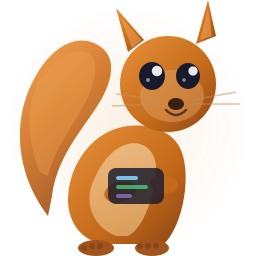

<p align="center">
  
</p>

<h1 align="center">OpenSquirrel</h1>

<p align="center">Native, GPU-rendered control plane for AI coding agents. Rust + GPUI. No Electron.</p>

Run Claude Code, Codex, Cursor, and OpenCode side by side with automatic sub-agent delegation, remote machine targeting via SSH, and persistent multi-turn sessions.

## What it does

- **Multi-agent grid** — Run multiple agents simultaneously in a responsive tiled layout. Agents auto-arrange based on count (1=full, 2=split, 4=2×2, etc).
- **Coordinator/worker delegation** — A primary agent (Opus) can automatically spawn sub-agents for focused tasks. Workers return condensed results, not full transcripts.
- **Remote machine targeting** — Agents can target local or remote machines via SSH + tmux. Configure machines in `~/.opensquirrel/config.toml`.
- **MCP integration** — MCP servers (Playwright, browser-use, etc.) are wired directly to agent CLI args. Select per-agent during setup.
- **Persistent sessions** — Agent state, transcripts, scroll positions, and pending prompts survive app restarts. Interrupted turns can be resumed.
- **Structured output parsing** — Parses `stream-json` output from all runtimes. Custom markdown rendering with code blocks, diffs, headings, bullets.

## Supported runtimes

| Runtime | Mode | Permission bypass |
|---------|------|-------------------|
| Claude Code | Persistent stdin (multi-turn) | `--dangerously-skip-permissions` |
| Codex | One-shot per prompt | `--dangerously-bypass-approvals-and-sandbox` |
| Cursor Agent | One-shot per prompt | `--yolo` |
| OpenCode | One-shot per prompt | Auto-approved in `run` mode |

## Build & run

OpenSquirrel supports macOS and Linux. Linux is the preferred packaging target for portable distribution via AppImage.

### Linux

OpenSquirrel now builds on Linux and can be packaged as an AppImage.

Prerequisites on Ubuntu/Debian:

```bash
sudo apt-get update
sudo apt-get install -y \
  build-essential clang cmake pkg-config curl \
  libasound2-dev libwayland-dev libxkbcommon-x11-dev \
  libfontconfig-dev libssl-dev libvulkan-dev mesa-vulkan-drivers
rustup component add rustfmt
```

Build and run from source:

```bash
cargo run
```

Build a release binary:

```bash
./scripts/build-linux-release.sh
```

Build an AppImage:

```bash
./scripts/build-appimage.sh
```

The resulting artifact is written to `dist/OpenSquirrel-x86_64.AppImage`.

Build a Debian package:

```bash
./scripts/build-deb.sh
```

The resulting artifact is written to `dist/opensquirrel_0.1.0_amd64.deb` on amd64 systems.

Run the AppImage:

```bash
chmod +x dist/OpenSquirrel-x86_64.AppImage
./dist/OpenSquirrel-x86_64.AppImage
```

Download and run the current Linux preview AppImage in one line:

```bash
curl -L https://github.com/dazeb/OpenSquirrel/releases/download/v0.1.0-linux-preview/OpenSquirrel-x86_64.AppImage -o OpenSquirrel.AppImage && chmod +x OpenSquirrel.AppImage && ./OpenSquirrel.AppImage
```

If your environment has AppImage runtime quirks or fails to mount/run directly, use the extract-and-run fallback:

```bash
curl -L https://github.com/dazeb/OpenSquirrel/releases/download/v0.1.0-linux-preview/OpenSquirrel-x86_64.AppImage -o OpenSquirrel.AppImage && chmod +x OpenSquirrel.AppImage && APPIMAGE_EXTRACT_AND_RUN=1 ./OpenSquirrel.AppImage
```

If the app starts but exits with `NoSupportedDeviceFound`, install Vulkan userspace tools and drivers, then verify with `vulkaninfo --summary`.

Install the Debian package:

```bash
sudo apt install ./dist/opensquirrel_0.1.0_amd64.deb
```

WSL2 note: GPUI currently behaves better through X11 than Wayland under WSLg. If Wayland startup fails, run:

```bash
WAYLAND_DISPLAY='' cargo run
```

### macOS

Requires Rust toolchain and Metal GPU.

To run as a proper macOS `.app` bundle with the squirrel icon:

```bash
# Build
cargo build --release

# Create .app bundle
mkdir -p dist/OpenSquirrel.app/Contents/{MacOS,Resources}
cp target/release/opensquirrel dist/OpenSquirrel.app/Contents/MacOS/OpenSquirrel
cp assets/OpenSquirrel.icns dist/OpenSquirrel.app/Contents/Resources/

# Launch
open dist/OpenSquirrel.app
```

Note: macOS `.app` bundles don't inherit your shell PATH. If agents like `claude` or `npx` aren't found, run the binary directly instead of via the `.app` bundle.

## Keybinds

No vim modes. Text input is always active.

On macOS, shortcuts use `Cmd`.
On Linux, the same shortcuts map to `Ctrl`.

| Key | Action |
|-----|--------|
| `Enter` | Send prompt |
| `Escape` | Dismiss overlay (palette, setup wizard, search) |
| `Cmd-N` / `Ctrl-N` | New agent (opens setup wizard) |
| `Cmd-K` / `Ctrl-K` | Command palette (themes, settings, compact context, kill, views) |
| `Cmd-F` / `Ctrl-F` | Search transcripts |
| `Cmd-]` / `Cmd-[` or `Ctrl-]` / `Ctrl-[` | Next / prev pane within group |
| `Cmd-}` / `Cmd-{` or `Ctrl-}` / `Ctrl-{` | Next / prev group |
| `Cmd-V` / `Ctrl-V` | Paste from clipboard |
| `Cmd-=` / `Cmd--` or `Ctrl-=` / `Ctrl--` | Zoom in / out |

**Setup wizard:** Arrow keys to navigate, `Enter` to drill into directories, `Backspace` to go up, `Tab` to advance step, `Shift-Tab` to go back.

## Configuration

Config lives at `~/.opensquirrel/config.toml`. Defines runtimes, models, MCP servers, machines, themes, and settings.

State is persisted at `~/.opensquirrel/state.json` (agents, transcripts, scroll positions).

## Architecture

~7,200 lines of Rust across 3 files:
- `src/main.rs` — UI, agent lifecycle, rendering, keybinds, persistence
- `src/lib.rs` — Line classification, markdown parsing, diff summarization, helpers
- `tests/state_tests.rs` — 30 integration tests covering navigation, scrolling, themes, search, agent lifecycle

Built on [GPUI](https://crates.io/crates/gpui) (the UI framework from Zed, used as a standalone crate). GPU-rendered via Metal on macOS and Linux GPU backends through GPUI.

## Themes

midnight, charcoal, gruvbox, solarized-dark, light, solarized-light, ops, monokai-pro

## License

MIT
